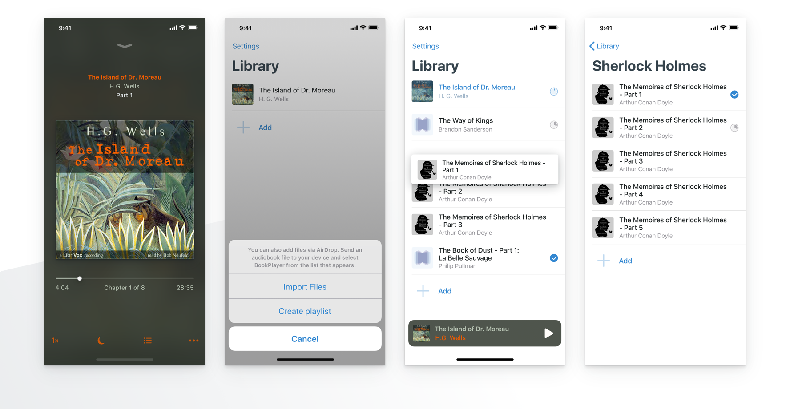

    

Please visit our [Wiki](https://github.com/TortugaPower/BookPlayer/wiki) for our [FAQ](https://github.com/TortugaPower/BookPlayer/wiki/FAQ) and [guides](https://github.com/TortugaPower/BookPlayer/wiki/Developer-Guide) on how to add new themes and icons to the app.

## Features

### Import

- Using [AirDrop](https://support.apple.com/en-us/HT204144#receive)  from your Mac or iOS device
- From [Files](https://support.apple.com/en-us/ht206481) and other apps on your device
- Via [File Sharing](https://support.apple.com/en-us/HT201301) in iTunes on your Mac or PC

### Manage 

- Maintain and see progress of your books
- Mark books as finished
- Drag & Drop to sort your library
- Create playlists
    - Automatically play items in turn
    - Play the first unfinished file by tapping on the playlist artwork
    - Move files to playlists from the library or import them directly

### Listen

- Control audio playback from the lock screen or the control center
- Play and navigate books with Chapters
- Jump to start of the current book
- Change playback speed
- Smart rewind
- Volume Boost
- Support for remote events from headset buttons and the lock screen
- Sleep timer with adjustable duration
- Support for VoiceOver

### Upcoming features

See [our Roadmap on GitHub](https://github.com/GianniCarlo/Audiobook-Player/projects/1) for details

## Contributing

Pull requests and ideas are always welcomed. Please [open an issue](https://github.com/GianniCarlo/Audiobook-Player/issues/new) if you have any suggestions or found a bug. 👍 See our [Contribution Guidelines](./CONTRIBUTING.md) for details.

If you enjoy BookPlayer, we would be glad if you consider writing a review on the [App Store.](https://itunes.apple.com/us/app/bookplayer-audio-book-player/id1138219998?ls=1&amp;mt=8)

### Maintainers

- [@GianniCarlo](https://github.com/GianniCarlo) - Original Idea & Creation
- [@pichfl](https://github.com/pichfl) - UI Design & Artwork
- [@ryantstone](https://github.com/ryantstone) - VoiceOver Support

### Contributors

- [@bryanrezende](https://github.com/bryanrezende) - Smart rewind
- [@e7mac](https://github.com/e7mac) - Speed control, Autoplay
- [@gpambrozio](https://github.com/gpambrozio) - Volume Boost
- [@vab9](https://github.com/vab9) - AirDrop Support
- [@atomicguy](https://github.com/atomicguy) - Zip Support

A full list of all contributors can be found [on GitHub.](https://github.com/GianniCarlo/Audiobook-Player/graphs/contributors)

## Dependencies

Managed with [Carthage](https://github.com/Carthage/Carthage)

- [ColorCube](https://github.com/pixelogik/ColorCube) for extracting artwork colors
- [DeviceKit](https://github.com/dennisweissmann/DeviceKit) for device information used in support requests
- [Kingfisher](https://github.com/onevcat/Kingfisher) for contributors' profile pictures
- [MarqueeLabel](https://github.com/cbpowell/MarqueeLabel) for scrolling labels
- [DirectoryWatcher](https://github.com/GianniCarlo/DirectoryWatcher) for events on the document's folder
- [Sentry](https://github.com/getsentry/sentry-cocoa) for crash reporting
- [Sweetercolor](https://github.com/jathu/sweetercolor) for handling artwork colors
- [SwiftReorder](https://github.com/GianniCarlo/SwiftReorder) for drag-and-drop on the UITableView
- [SwiftyStoreKit](https://github.com/bizz84/SwiftyStoreKit) for the tip jar
- [ZIPFoundation](https://github.com/weichsel/ZIPFoundation) for zip files

Managed with [Homebrew](https://brew.sh)

- [SwiftLint](https://github.com/realm/SwiftLint)
- [SwiftFormat](https://github.com/nicklockwood/SwiftFormat)

## License

Licensed under [GNU GPL v. 3.0](https://opensource.org/licenses/GPL-3.0). See `LICENSE` for details.
